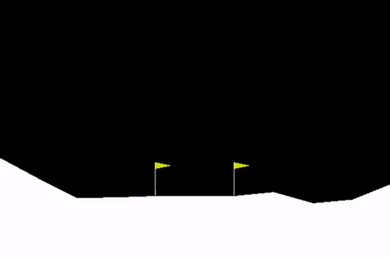

# Lunar_lander_DQN

TensorFlow implementation of Deep Q-learning (DQN) tested on the OpenAI gym Lunar lander environment.

- [LunarLander-v2](https://gym.openai.com/envs/LunarLander-v2/) 

### Preview


### Usage
- To train and test a network, run `lunar_lander.py`

### Dependencies
- Trained and tested on:
```
Python 2.7
numpy 1.16.4
gym 0.13.0
tensorflow 1.14.0
```
